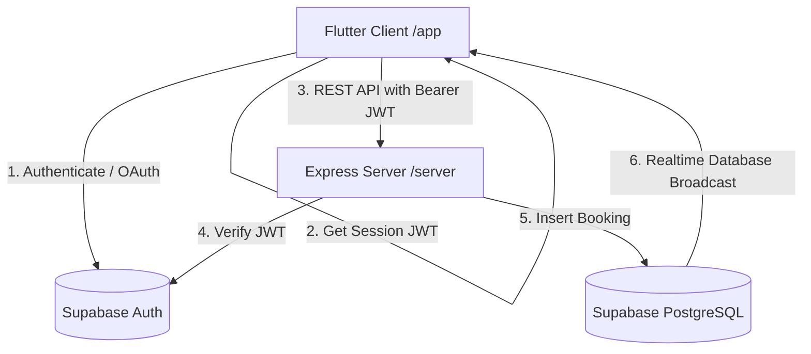

# QuickSlot ⚡ Sports Slot Booking App

QuickSlot is a real-time, concurrency-safe mobile application for booking sports slots (e.g., badminton courts, tennis courts, basketball courts). It consists of a **Flutter** client and a **Node.js Express** backend server, connected to a **Supabase (PostgreSQL)** database.

---

## 🚀 Key Features

*   **Double-Booking Prevention**: Guarantees database-level consistency under concurrent booking attempts. If two users try to book the exact same slot at the same microsecond, exactly one succeeds while the other is shown a clear in-app error warning.
*   **Real-time Availability Sync**: Updates slot status (Taken vs. Book) instantly across all connected user devices in real-time when slots are booked or cancelled, utilizing Supabase Realtime listeners.
*   **Smart Slot Availability Filters**:
    *   Automatically hides slots in the past for the current day.
    *   Hides "Today" entirely from the venue date selector if the current time exceeds the operating hours (past 9:00 PM).
*   **Dynamic Booking Filters**: Filter active/past bookings by Date, Time, or Sport Type.
*   **Disabled Calendar Dates**: On the "My Bookings" filter calendar, dates without any user bookings are automatically disabled to prevent empty queries.
*   **12-Hour Formatting**: All slots and bookings are formatted in a clean 12-hour AM/PM format.
*   **Multi-Device Local Testing**: Connects to the local Express backend via your local Wi-Fi network configuration to allow live testing on physical devices.

---

## 🏗️ Architecture Overview

The system is designed with a Flutter client talking to a Node.js API server, which acts as the database controller. Supabase Auth handles identity, and Supabase Realtime manages direct change subscription notifications.



### ⚡ Concurrency & Double-Booking Prevention

1.  **Database Constraint**: The database enforces a `UNIQUE` index on `(venue_id, booking_date, start_time)` in the `bookings` table.
2.  **Atomic Insert**: When booking requests arrive at `POST /bookings`, PostgreSQL handles insertions atomically.
3.  **Conflict Interception**: If a duplicate slot insert occurs, PostgreSQL rejects it with a Unique Violation error (`23505`).
4.  **Client Feedback**: The Express server catches this code and responds with `409 Conflict`. The Flutter app intercepts `409` and shows a dialog explaining that the slot was just booked by another player, then refreshes the grid.

### 🔄 Real-time Update Synchronization

To make sure that when User A cancels/books a slot, User B's device updates instantly without pull-to-refresh:
1.  **Supabase Postgres Changes**: The Flutter client subscribes to Postgres changes on the `bookings` table filtered by `venue_id` (in the slots screen) or `user_id` (in the bookings screen).
2.  **State Invalidation**: When an event (`INSERT`, `DELETE`) is received, Riverpod invalidates the slot provider, forcing a quiet, reactive update of the UI.
3.  **Full Replica Identity**: The server configuration alters the table replica identity to `FULL` so that `DELETE` events carry the deleted column fields (like `venue_id` and `user_id`) to the realtime clients.

---

## 📂 Project Structure

```
swades/
├── app/                   # Flutter Mobile Client
│   ├── lib/
│   │   ├── models/        # Data models (venue, slot, booking, user)
│   │   ├── providers/     # State management (auth, booking, fcm, api_config)
│   │   ├── screens/       # Views (auth, venues list, venue details, my bookings)
│   │   └── main.dart
│   └── pubspec.yaml       # Flutter Dependencies
│
├── server/                # Node.js Express REST Backend
│   ├── server.js          # Server code (routes, middleware, FCM dispatcher)
│   ├── schema.sql         # PostgreSQL schema definition & initial seeds
│   ├── package.json       # Node Dependencies
│   └── .env               # Configuration (Supabase keys, port)
│
└── README.md              # Root Project Documentation
```

---

## 🛠️ Getting Started

### 1. Database & Supabase Configuration

1.  Create a project on [Supabase](https://supabase.com).
2.  Open the **SQL Editor** in the Supabase console, copy the queries in [schema.sql](file:///Users/admin/Downloads/swades/server/schema.sql), and run them to create `venues`, `bookings`, and `user_fcm_tokens`.
3.  Configure Realtime broadcast for the `bookings` table:
    *   Enable the **Realtime** replication toggle on the `bookings` table in the Supabase dashboard (Database -> Replication).
    *   Run the following query in the SQL Editor to ensure `DELETE` payloads contain all columns (essential for real-time slot releases):
        ```sql
        ALTER TABLE bookings REPLICA IDENTITY FULL;
        ```
4.  Turn off RLS or add public policies on the tables for testing purposes:
    ```sql
    ALTER TABLE venues DISABLE ROW LEVEL SECURITY;
    ALTER TABLE bookings DISABLE ROW LEVEL SECURITY;
    ALTER TABLE user_fcm_tokens DISABLE ROW LEVEL SECURITY;
    ```
5.  Get your **API URL** and **Anon Key** from Project Settings -> API.

### 2. Run the Express Backend

1.  Navigate to the `server` directory:
    ```bash
    cd server
    ```
2.  Create a `.env` file based on `.env.example`:
    ```env
    PORT=3000
    SUPABASE_URL=https://your-project-id.supabase.co
    SUPABASE_KEY=your-anon-key
    ```
3.  Install dependencies and start the local development server:
    ```bash
    npm install
    npm run dev
    ```
    The server will run on `http://localhost:3000`.

### 3. Run the Flutter App

1.  Find your computer's local Wi-Fi IP address (e.g., `192.168.1.5` on macOS via System Settings or `ifconfig`).
2.  Open [api_config.dart](file:///Users/admin/Downloads/swades/app/lib/providers/api_config.dart) and update `_localHostIp` with your machine's IP address:
    ```dart
    const String _localHostIp = '192.168.x.x'; // Your Wi-Fi IP
    ```
3.  Ensure your physical testing devices are connected to the **exact same Wi-Fi network**.
4.  Navigate to the `app` directory:
    ```bash
    cd app
    ```
5.  Install Flutter packages and launch:
    ```bash
    flutter pub get
    flutter run
    ```

---

## 📖 Sub-Module Readmes

For detailed instructions and source documentation, refer to:
*   [App README](file:///Users/admin/Downloads/swades/app/README.md) — Detailed description of state management, providers, and testing details.
*   [Server README](file:///Users/admin/Downloads/swades/server/README.md) — Reference for Express API routes, parameters, and database schemas.
