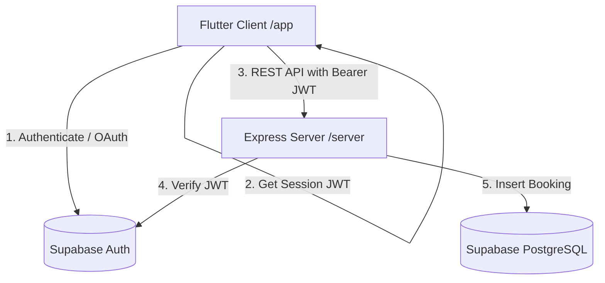

# QuickSlot ⚡ Sports Slot Booking App

QuickSlot is a real-time, concurrency-safe mobile application for booking sports slots (e.g., badminton courts, turf grounds). Users can authenticate via email/password or Google OAuth, view available venues, check hourly slots for any date, book them safely, and manage active bookings.

---

## 🏗️ Architecture Note

QuickSlot follows a monorepo structure consisting of a **Node.js + Express** API server and a **Flutter** client. It connects to a **Supabase (PostgreSQL)** database.



### Concurrency Strategy (Double-Booking Prevention)
The core requirement is that **no slot can be double-booked** (i.e., atomic slot reservation).
1. We enforce this at the database layer using a **`UNIQUE constraint`** on the `bookings` table:
   ```sql
   CONSTRAINT unique_venue_slot UNIQUE (venue_id, booking_date, start_time)
   ```
2. When two clients hit the `POST /bookings` endpoint simultaneously for the same slot, PostgreSQL's transactions guarantee that only one insert succeeds. The second insert will instantly fail with a **Unique Constraint Violation (PostgreSQL error code `23505`)**.
3. The Express backend catches the error code `23505` and returns a `409 Conflict` response to the client.
4. The Flutter client intercepts this `409` code, displays a detailed warning dialog telling the user the slot has been taken, and automatically re-fetches the slots grid to show the updated status.

---

## 🛠️ Setup & Running Locally

### 1. Database & Authentication (Supabase) Setup
1. Create a free project on [Supabase](https://supabase.com).
2. Go to the **SQL Editor** tab and execute the contents of [schema.sql](file:///Users/admin/Downloads/swades/server/schema.sql) to create the tables (`venues` and `bookings`) and seed initial data.
3. Disable Row Level Security (RLS) on both tables (or add public access policies) so the API backend can query them using your public keys:
   ```sql
   ALTER TABLE venues DISABLE ROW LEVEL SECURITY;
   ALTER TABLE bookings DISABLE ROW LEVEL SECURITY;
   ```
4. Obtain your project's **API URL** and **Anon Key** from the Supabase settings panel under *API*.
5. (Optional) For Google OAuth: Enable the Google provider under **Authentication -> Providers -> Google** in the Supabase console, and set your redirect URL to `io.supabase.quickslot://login-callback`.

### 2. Backend Server Setup
1. Open the [server](file:///Users/admin/Downloads/swades/server) directory.
2. Open the `.env` file and replace the values with your Supabase credentials:
   ```env
   SUPABASE_URL=your_project_url
   SUPABASE_KEY=your_anon_key
   PORT=3000
   ```
3. Install dependencies and start the backend:
   ```bash
   cd server
   npm install
   npm run dev
   ```
   The backend will start listening at `http://localhost:3000`.

### 3. Flutter Client Setup
1. Open the [app](file:///Users/admin/Downloads/swades/app) directory.
2. Ensure you have the Flutter SDK configured. Add required packages and launch the app on an Android emulator, iOS simulator, or web:
   ```bash
   cd app
   flutter pub get
   flutter run
   ```
   *Note: If running on an Android emulator, the app automatically maps the server URL to `http://10.0.2.2:3000` to reach your host's local port.*

---

## ✂️ What We Cut & Why
* **WebSocket Updates (Bonus)**: We implemented rapid local state invalidation using Riverpod (which auto-refreshes the UI instantly after booking actions) instead of WebSockets. WebSockets would require setting up a custom pub/sub server or Supabase Realtime client, which was deferred to ensure the REST flow was bulletproof.

---

## 📅 With One More Day...
1. **WebSockets / Supabase Realtime**: Implement realtime broadcast so that slot changes automatically reflect on other devices instantly without having to refresh.
2. **Offline Read Cache**: Integrate Hive or Isar to store "My Bookings" locally, allowing users to view their schedule even without internet access.
3. **Advanced Filters**: Allow filtering slots by morning/afternoon/evening time.

---

## 🤖 AI Usage Note
* **What we used AI for**: Creating the Express routing logic, creating the clean Riverpod provider structures, and designing the responsive Dark Slate UI theme in Flutter.
* **What the AI got wrong (and we caught)**: The AI initially used `http://localhost:3000` as the backend URL across all platforms. On Android emulators, this fails because the emulator treats `localhost` as its own loopback interface. We caught this and implemented a platform-aware base URL resolver in `api_config.dart` that dynamically routes to `http://10.0.2.2:3000` when running on Android.
